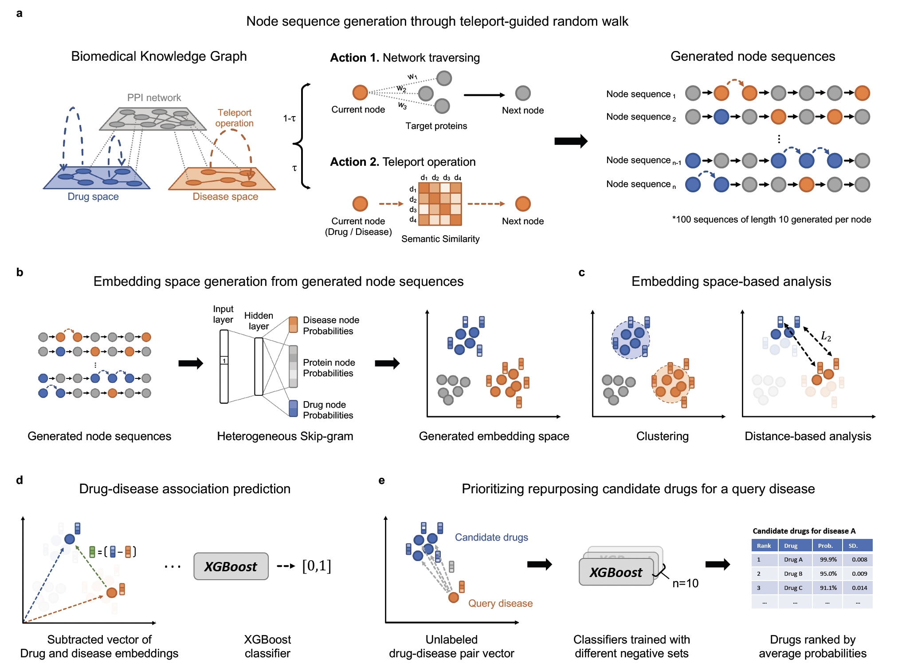

# DREAMwalk
[](https://zenodo.org/badge/latestdoi/562475574)

The official code implementation for DREAMwalk from our paper, [Biomedical knowledge graph learning for drug repurposing by extending guilt-by-association to multiple layers](https://www.nature.com/articles/s41467-023-39301-y).

We also provide codes for calculating semantic similarities of entities given hierarchy data, along with example heterogeneous network file and notebook file for generating node embedding and predicting associations.

## Model description

The full model architecture is provided below. DREAMwalk's drug-disease association prediction pipeline is consisted of three steps;

Step 1. Create semantic similarity network from semantic hierarchies

Step 2. Node embedding generation through teleport-guided random walk

Step 3. Drug-disease association prediction (or prediction of any other links)



## Setup
First, clone this repository and move to the directory.
```
git clone https://github.com/eugenebang/DREAMwalk.git
```
To install the appropriate environment for DREAMwalk, you should install [conda](https://docs.conda.io/en/latest/) package manager.

After installing `conda` and placing the `conda` executable in `PATH`, the following command will create `conda` environment named `dreamwalk`. It will take up to 10 minutes to setup the environment, but may vary upon the Internet connection and package cache states.
```
conda env create -f environment.yaml && \
conda activate dreamwalk
```

To check whether DREAMwalk works properly, please refer to the Example codes section below.

## Example codes
Sample code to generate the embedding space and predict drug-disease associations are provided in [`run_demo.ipynb`](run_demo.ipynb).

- The file formats for each input file can be found in [here](demo).
- Detailed instructions in running the codes can be found [here](DREAMwalk).

### Software requirements

**Operating system**

DREAMwalk training and evaluation were tested for *Linux* (Ubuntu 18.04) operating systems.

**Prerequisites**

DREAMwalk training and evaluation were tested for the following python packages and versions.

- **For embedding generation**
  - `python`= 3.8
  - `networkx`= 2.8.8
  - `numpy`=1.23.3
  - `pandas`=1.4.4
  - `scikit-learn`=1.1.3
  -  `scipy`=1.9.1
  - `tqdm`=4.64.1
  - `parmap`=1.6.0
  - `xgboost`=1.7.4
  
## Citation
Bang, D., Lim, S., Lee, S., & Kim, S. Biomedical knowledge graph learning for drug repurposing by extending guilt-by-association to multiple layers. _Nature Communications_ (2023)
```
@article{bang2023biomedical,
  title={Biomedical knowledge graph learning for drug repurposing by extending guilt-by-association to multiple layers},
  author={Bang, Dongmin and Lim, Sangsoo and Lee, Sangseon and Kim, Sun},
  journal={Nature Communications},
  volume={14},
  number={1},
  pages={3570},
  year={2023},
  publisher={Nature Publishing Group UK London}
}
```
